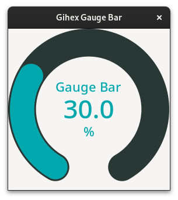
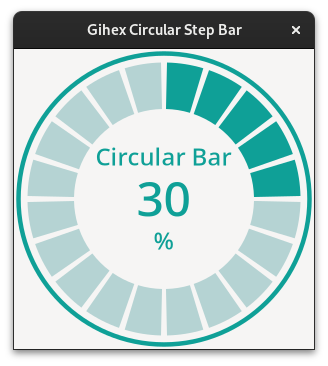

# GIHEX WIDGET C

[](https://github.com/yogiastawan/gihex-widget-c)
[](https://github.com/yogiastawan/gihex-widget-c/blob/main/LICENSE)
[](https://github.com/yogiastawan/gihex-widget-c/issues)

## Introduction

Library that contains custom GTK4 widgets using C language

## Widgets List
  
| **GihexGaugeBar** | **GihexCiruclarStepBar** |
|:-----------------:|:----------------------:|
|  |  |
<!-- | **GihexCircleBar** | -->
  

   

## Build Dependencies

To build this project, your system need install following dependencies:
- [cmake](https://cmake.org/)
- [GTK4](https://www.gtk.org) Development
- C Compiler ([`GCC`](https://gcc.gnu.org/), [`CLANG`](https://clang.llvm.org/), or others)

## Build Option
Variable that can be set while build project are:
| Option | Default Value | Description|
|--------|---------------|------------|
|  EXAMPLES | ON | Compile examples and add to `ctest` |
| SHARED | OFF | If set to ON `Shared` library will be created instead `Static` library. So by default static library will be created |

## Build
- Set build directory. Example create directory `build`:
  ```sh
  mkdir build
  cd build
  ```
- Configure cmake. Example to not include examples on build:
  ```sh
  cmake --build --config Debug --target all -DEXAMPLES=OFF ..
  ```
- Make project
  ```sh
  make
  ```